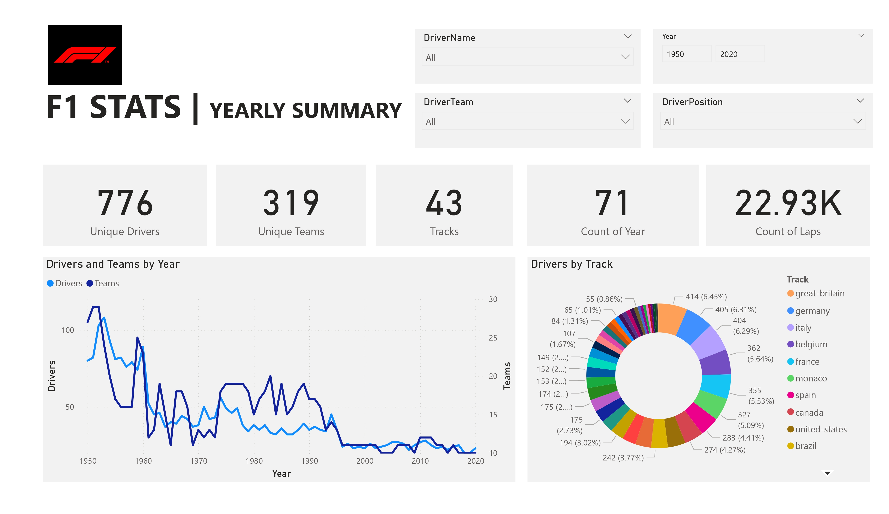

# Formula 1 Data Analysis with DBMS and Power BI Dashboard
##Project Overview
This project utilizes a relational database management system (DBMS) to manage and analyze Formula 1 racing data. The data is loaded into SQL tables from various CSV files and then analyzed using SQL queries. A Power BI dashboard is used to visualize the results, providing insights into various aspects of Formula 1 races, such as driver standings, lap times, and race results.

##Setup Instructions

 ##### Clone the repository
```bash
https://github.com/mety0r/F1-Analytics.git
```

##Database Setup:

- Ensure you have a MySQL database installed.
- Run the provided SQL scripts to create and populate the tables.
- The CSV files must be available locally on your system to load the data into the respective tables.
```bash
  CREATE DATABASE formula1;
USE formula1;
-- Run the SQL commands to create tables and load data from CSV files.
```
 


